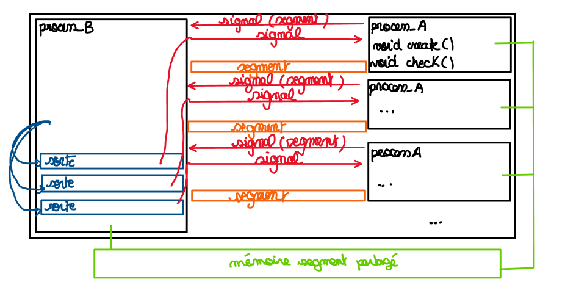

# Project 1 : multi-thread
  ------------------------

## Students :
   ----------
- [x] Umons 190134
- [X] Umons 181865
- [X] Umons 193228

## Subject :
   ---------

  Implement an application consisting of a triage process and multiple processes that submit arrays
  to this one. The sent arrays can contain a maximum of 65,536 signed integers. A submission process
  starts by generating an array of signed integers before submitting it to the sorting process. When he finished
  work, the triage process signals the process that submitted the array that its contents have been processed. The process of
  submit verifies that its array is indeed sorted and displays a feedback in the terminal stating the size of the array
  as well as its minimum element.

## About:
   ------
 * Process 1 (creator) shares the array to process 2 (sorting) by memory segments.
 * Creator sends the key of segment memory to sorting by signal. 
 * Doesn't use the mutex because only one process uses the array in same time.
 * Process of sorting creates one thread by array and close this after sorting.
 * The list of elements start with the size of list (size with the first element) !

## Improvement:
   ------------
 * duplicate code such as the segment memory open.
 * group the same objects in header
 * replace active wait in creator 

## Launch app:
   ----------

> ./run.sh [number_of_process]

## Individual command:
   --------
Before start the app:
> touch mem

Launch the process :
> gcc -pthread sorting.c -o sorte.bin &> /tmp/null && ./sorte.bin &

> gcc creator.c -o create.bin &> /tmp/null && ./create.bin [random_name]

Stop the process (creator and sorting) :
/!\ choose between /!\
> CTRL + C

> kill -INT [pid]

Clean the directory :
> rm sorte.bin create.bin mem* mypid
