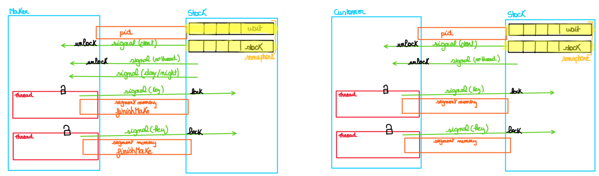
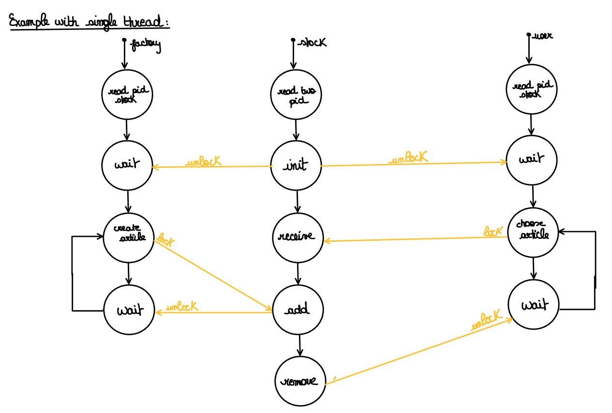

# Project 2: factory & stock & customer

## Students :

- [x] Umons 190134
- [X] Umons 181865
- [ ] Umons 193228

## Commands:

> ./run.sh [file_of_shop]

or

(Note: the first file must have two parameters (second parameter is True) ! )

> touch startMe

> gcc -pthread  parser.c logger.c maker.c -o maker.bin -lrt && ./maker.bin [file_shop] True

> gcc -pthread  parser.c logger.c stock.c -o stock.bin -lrt && ./stock.bin [file_shop]

> gcc -pthread  parser.c logger.c customer.c -o customer.bin -lrt && ./customer.bin [file_shop]
